 

 

&nbsp;

---

## About

**Senior Frontend Engineer / Creative Product Engineer** with 14 years of experience building digital products, frontend systems and interactive web experiences.

I work across **frontend architecture, product engineering and creative technology** — from large-scale applications and design systems to motion, WebGL and realtime interaction.

Current focus: **Three.js, WebGL, AI-native interfaces, generative UI and high-performance frontend systems.**

---

## Focus

<table>
<tr>

<td width="33%" valign="top">

### Frontend Systems

React  
TypeScript  
Next.js  
Architecture  
Design Systems  
Performance

</td>

<td width="33%" valign="top">

### Creative Technology

Three.js  
WebGL  
3D Interfaces  
Motion Systems  
Creative Coding  
Interaction Design

</td>

<td width="33%" valign="top">

### Product + AI

AI-native UX  
Generative UI  
Realtime Systems  
LLM Interfaces  
Automation  
Product Engineering

</td>

</tr>
</table>

---

## Technology

  

---

## GitHub Activity

  
 

  

 
---

### Creative Engineering · Frontend Architecture · WebGL · AI-native Products

 

I’m interested in systems where **engineering, interaction and visual design behave as one product language**.

  

